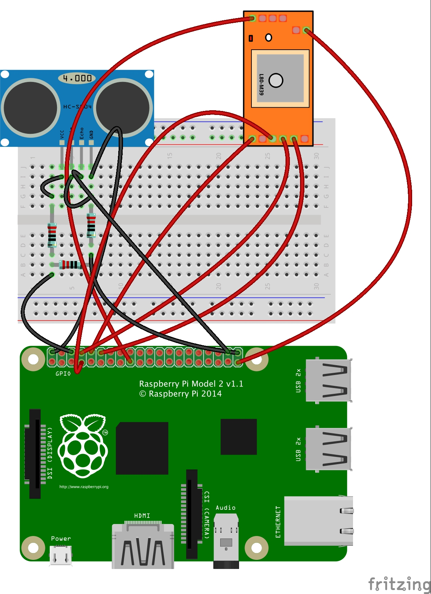

#BOM
##Hardware

1) Raspberry Pi 2

2) SenseHAT

3) Microstack GPS module

4) HCSR04 ultrasonic range-finder

5) Three 1K ohm resistors

(prototype)

6) Breadboard and wires

## Software

1) [Microstacknode IOT Python3 library](https://github.com/microstack-IoT/python3-microstacknode)

2) [SenseHat Python3 library](https://pythonhosted.org/sense-hat/)

3) [HCSR04 Python library](https://pypi.python.org/pypi/hcsr04sensor)

4) Latest version of Raspbian (Jessie) 

5) Pygame library
